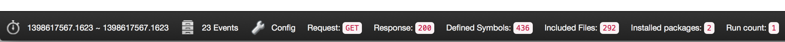

# Using RoaveDeveloperTools in a ZendFramework Application

**RoaveDeveloperTools** ships as a module that can be enabled in a `Zend\Mvc\Application`. To use
it, simply enable module `Roave\DeveloperTools` in your `config/application.config.php` configuration
file.

Once the module is enabled, you should be able to see a toolbar similar to the following (may vary, as
the module is undergoing heavy development) at the bottom of your web-pages:



Also, you may browse to `http://your-app/path/roave-developer-tools/list-inspections` to have a list
of all the inspections that **RoaveDeveloperTools** recorded.

## ZendFramework Module wiring

The module provides some base wiring for the interfaces described in [architecture.md](architecture.md).

The module components are under the `Roave\DeveloperTools\Mvc` namespace. Components under this
namespace are specific about profiling a Zend Framework (2.x, currently) application.

 - an "inspector" configuration, containing the names of the services pointing at inspectors (a
   dedicated `InspectorPluginManager` will be provided)
 - a default inspection repository, implementing
   the `Roave\DeveloperTools\Repository\InspectionRepositoryInterface`
 - one or more main listeners that will fetch configured inspectors and cycle through all of them
   during the `Zend\Mvc\MvcEvent::EVENT_FINISH` event triggering, persisting each of the inspectors'
   results
 - generic HTML and JSON renderers for the inspections that are provided out of the box
 - a "toolbar" listener that will read the last persisted inspection and provide overview of the
   collected inspections using a set of configured
   `Roave\DeveloperTools\Renderer\InspectionRendererInterface` instances
 - a set of controllers to be used to analyze and render previous inspections

## Writing extensions for RoaveDeveloperTools

As explained in [architecture.md](architecture.md), RoaveDeveloperTools relies on two main interfaces
to collect data about the application runtime, which are the `InspectionInterface` and the
`InspectorInterface`.

In order to extend RoaveDeveloperTools with your own module-specific (or even business-specific)
inspections, you will need to implement your own custom inspector object. For example, let's collect
the amount of times that our `ShopCartApi` was used:

```php
class ShopCartApiCounterInspector implements \Roave\DeveloperTools\Inspector\InspectorInterface
{
    private $shopCartApi;

    public function __construct(ShopCartApi $shopCartApi)
    {
        $this->shopCartApi = $shopCartApi;
    }

    public function inspect(\Zend\EventManager\EventInterface $event)
    {
        // ShopCartCountInspection implements
        return new ShopCartCountInspection($this->shopCartApi->callCount());
    }
}
```

This inspector is quite simple, as it just extracts some information from an existing service and
converts it into an inspection.

A couple of things worth noting are that this inspector may be called at *any* time, and *any* number
of times during the runtime of your application, so be very careful if you manipulate any stateful
information in it. As a suggestion, always pull information from either the passed in event or
from a second service that is a dependency of your collector.

## Configuration

The current configuration is still work-in-progress and will be finalized once the complete output
PoC is done.
